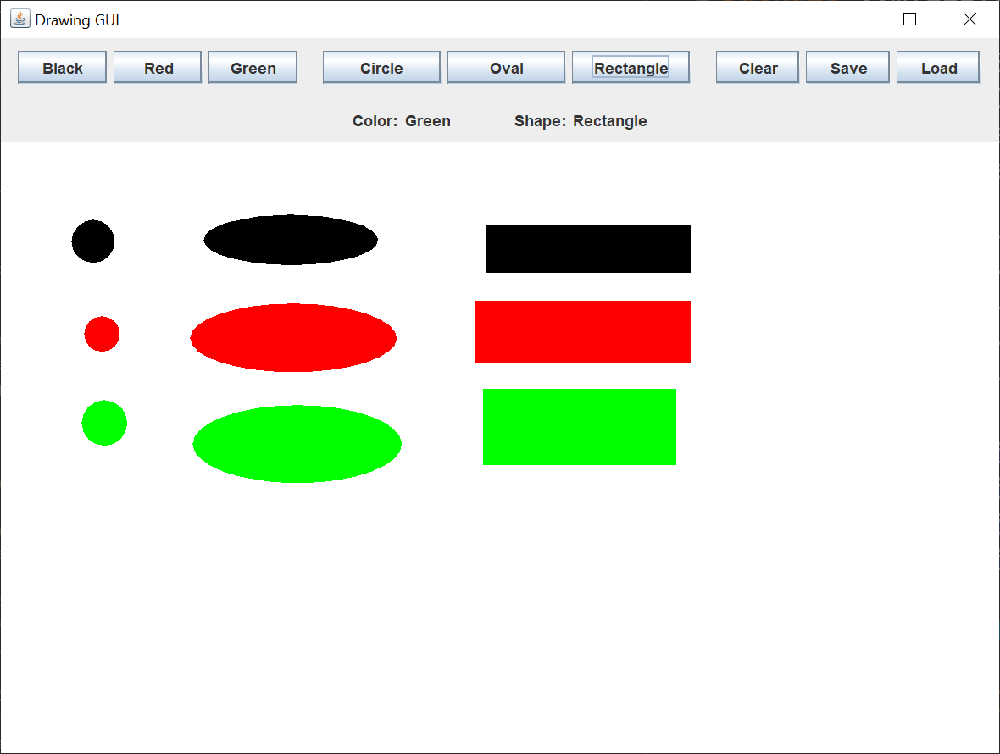

# Simple Drawing

## Introduction

Recently on Stack Overflow, a student had questions about his Swing project.  He was trying to create a simple Swing drawing application.  The code he posted was incomplete in several ways.  Now, I'm not trying to pick on the student.  I gave his projet a try, and it took me close to 8 hours to code it from start to finish.  I have to wonder how much time the lecturer / professor gave his students for the project, and how much the student underestimated what was involved in creating the project.

I based my GUI design loosely on what the student designed.  Here's what my version of the GUI looks like:

The user has a choice of three colors and three shapes.  The user can also clear the drawing area, save the drawing, and load a previously saved drawing.  The drawing is saved using the Java `Serializable` interface.  Although it's not shown in the image, the user can left-click on an existing shape and remove it.

To draw a shape, the user presses the left mouse button somewhere on the drawing panel, drags the mouse to a different position, and releases the left mouse button.  This also works with the right mouse button.  While the user is dragging, a blue rectangle outline is drawn.  When the user releases the mouse button, the blue rectangle disappears and is replaced by the shape.  All the shapes are filled in, as you can see in the picture.

This is a pretty simple drawing application.  Microsoft Paint, to take one example, has way more functionality.  As we'll see, this simple drawing application leads to some complex code.  This type of Swing application makes for a good end-of-semester project.

## Explanation

If you’re not familiar with Java Swing, Oracle has an excellent tutorial to get you started, [Creating a GUI With Swing](https://docs.oracle.com/javase/tutorial/uiswing/index.html). Skip the Netbeans section.

When I code a Swing application, I use the [model/view/controller](https://en.wikipedia.org/wiki/Model%E2%80%93view%E2%80%93controller) (MVC) pattern.  To be fair, the student attempted to use the MVC pattern.  The MVC pattern implies that you create the model first, then the view, then the controllers.

In Java Swing, the MVC pattern is implemented like this:

- The view reads information from the model
- The view does not update the model
- The controller updates the model and repaints/revalidates the view.

There's usually not one controller to "rule them all".  Each listener updates its own portion of the model and repaints/revalidates its own portion of the view.  The nine `JButtons` in the Swing GUI use nine separate anonymous controller classes.  They are anonymous because they're two to three lines of code each.  It's not worth setting up separate controller classes for such short classes.

Not counting the anonymous controller classes, I wrote two enum classes, two model classes, three view classes, and two controller classes.  Including the initiator class, that's ten separate classes for this simple drawing application.

I did not write this code all at once.  I wrote a little and tested a lot.  I'd add one method at a time and test the code.  Using the Eclipse Java integrated development environment (IDE) makes rapid coding and testing much easier, but any IDE would work just as well.

### Model

The `ColorType` enum contains the three colors.  Each enum points to a `Color` and a display `String`.  This way, I can get the drawing `Color` and the `JButton` labels from the enum.

The `ShapeType` enum contains the three shapes.  Each enum points to a display `String`.  This way, I can get the `JButton` labels from the enum.

The `DrawingShape` class is a plain Java getter/setter class that contains one drawing shape.  Each shape has an `int` x, y, width, and height.  Each shape has a `ColorType` and a `ShapeType`.

The `DrawingModel` class is a plain Java getter/setter class that contains the current `ColorType` and `ShapeType`, two `Point` instances for drawing a rectangle outline, and a `java.util.List` of `DrawingShape` instances.

### View

The `DrawingFrame` class creates the `JFrame`.  The `JFrame` uses a default `BorderLayout`.  The `JFrame` methods must be called in a specific order.  This is the order I use for most of my Swing applications.  I have three helper methods that call methods in the `JPanel` classes.  These helper methods allow me to pass the `DrawingFrame` instance to the controller classes.  The controller classes don't need to know how my GUI is structured.

The `ControlPanel` class creates the control `JPanel`.  The control `JPanel` is made up of a button `JPanel` and a display `JPanel`.  The button `JPanel` uses a `FlowLayout` to lay out the `JButtons`.  I use a `Box` `createHorizontalStrut` method to space the color `JButtons`, shape `JButtons`, and control `JButtons`.  This makes it easier for the user to see the groups.

A `JMenuBar` would probably work better than the nine `JButtons`, but I went with what the student had posted in his question.  Creating an intuitive user experience is difficult.  What seems natural to a developer might be strange to a typical user of the application.

The display `JPanel` shows the current `ColorType` and `ShapeType` instances.

The button `JPanel` and display `JPanel` are combined into a control `JPanel` using a `BorderLayout`.  You can create complex Swing layouts by nesting `JPanels` with simpler layouts.

The `DrawingPanel` class creates a drawing `JPanel` to draw the shapes.  The `DrawingPanel` class draws the shapes and the rectangle outline.  Period.  Nothing else.  It's up to the controller classes to update the model and give the illusion of animation when the user drags the mouse.

### Controller

The `DrawingListener` class implements a `MouseListener` and a `MouseMotionListener`.  I use a `MouseAdapter` so I don't have to implement every method of the two interfaces.  I've only implemented the methods I needed, mouse pressed, released, moved, and dragged.

The `LoadSaveSerializable` class contains the code for saving the `DrawingModel` to disk, and loading the `DrawingModel` from disk.  For some reason, I had to save and load each component of the `DrawingModel` separately.
